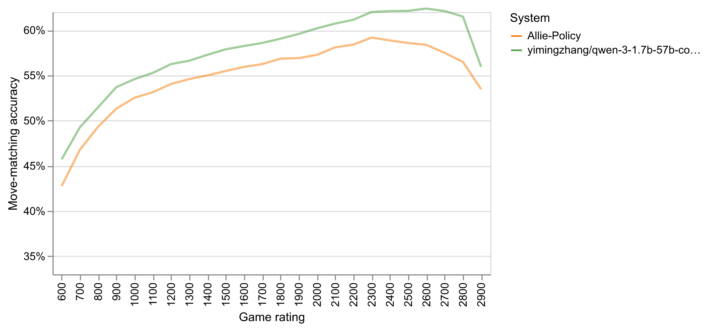

# allie-v2

### Quickstart

#### Environment Setup
```bash
# Create virtual environment with Python 3.9-3.12 (NOT 3.13, vLLM has compatibility issues)
uv venv --python 3.12
source .venv/bin/activate

# Install project dependencies
uv pip install -e .
```

#### For Training
```bash
uv pip install setuptools
uv pip install -e picotron --no-build-isolation
uv pip install vllm --torch-backend=auto
```

#### For CPU-Only Inference on Lichess
vLLM is pinned as a git submodule to ensure a working version for CPU inference.
```bash
# Initialize submodules (vllm_source and lichess-bot)
git submodule update --init --recursive

# Build vLLM for CPU
cd vllm_source
uv pip install -r requirements/cpu-build.txt --index-strategy unsafe-best-match --torch-backend cpu
uv pip install -r requirements/cpu.txt --index-strategy unsafe-best-match --torch-backend cpu
VLLM_TARGET_DEVICE=cpu uv pip install -e . --no-build-isolation
cd ..

# Fix shared memory permission issue on multi-user systems
uv pip install "model-hosting-container-standards>=0.1.12,<1.0.0"
```

### Allie (v2)
We have pre-trained a Qwen 3 1.7b model on 57B Lichess tokens that drastically outperforms Allie and plays all time control formats. We also cleaned up the inference pipeline to use vLLM.



### Training
- Script: `scripts/train.sh`
- Requires 8 GPUs and an HF token stored at `~/secrets/hf-token`
- Command: `torchrun --nproc_per_node 8 picotron/train.py --config configs/main_runs/qwen-3-4b-58b.json`
- Logs stream to `log_qwen-3-4b-58b.out`

### Model Exporting
- Script: `src/tools/hf/export_checkpoint.py`
- Example:
  ```bash
  uv run python src/tools/hf/export_checkpoint.py \
    --config configs/tiny_runs/qwen-3-1.7b-muon.json \
    --checkpoint models/tiny-qwen-3-1.7b-muon-1b/3814/weights_tp_rank_world_size=0_1_pp_rank_world_size=0_1.pth \
    --output-dir exports/tiny-qwen-3-1.7b-muon-1b \
    --dtype bfloat16
  ```
- Outputs `model.safetensors` and `config.json`; pass `--tokenizer-dir` to copy tokenizer files

### Model Testing
Verify vLLM model loading and inference correctness:
```bash
python src/tools/eval/test_vllm_model.py --model yimingzhang/qwen-3-1.7b-57b-cool-from-66550-step96800
```
Tests that the model produces sensible moves for known opening positions.

### Lichess Bot
The lichess-bot integration uses a custom vLLM engine to generate chess moves.

#### Setup
lichess-bot is integrated as a git submodule with custom files:
- `vllm_engine.py` - HTTP API client for vLLM server
- `config.yml` - Bot configuration (not tracked, contains API token)
- `homemade.py` - Modified to import VLLMEngine

#### Running the Bot
```bash
# Start vLLM server (in one terminal)
source .venv/bin/activate
vllm serve yimingzhang/qwen-3-1.7b-57b-cool-from-66550-step96800 \
  --max-model-len 1024 --enforce-eager --port 12398

# Run lichess-bot (in another terminal)
source .venv/bin/activate
cd src/lichess-bot
python lichess-bot.py --config config.yml
```

See `scripts/lichess.sh` for SLURM job configuration.

### Token Statistics
- `data/tokens_v2` sequences of length 1025: train 54,368,123 · val 5,371

### License
MIT
